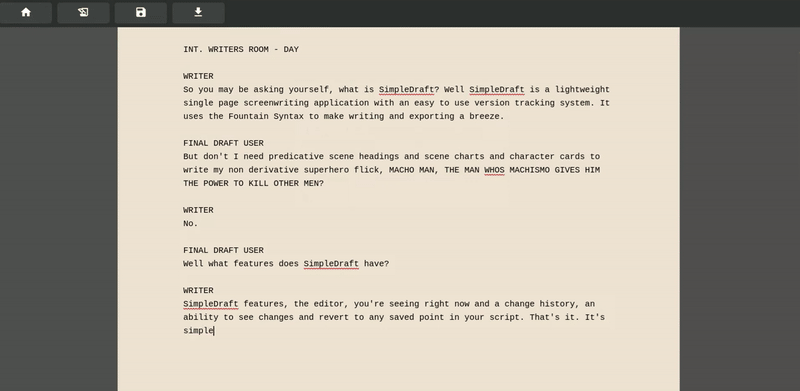

# 🎬 SimpleDraft

💻 A simple brower based screenwriting app.

# Stack

React / Node / Express / Typescript / PostgreSQL
- [](https://typescriptlang.org "Go to TypeScript homepage")

# Features

- ✅ 🖋️ Write screenplays utilizing the Fountain syntax for speed and simplicity.
- ✅ 📌 Manage multiple projects with an intuitive all drafts view.
- ✅ 📄 Write your script in a clean distraction-free editor.
- ✅ 📇 Keep track of drafts and changes with SimpleDraft's lightweight version tracking system.
- ✅ ⏪ Revert to a previous version at any time!
- ✅ 📜 Download draft as a .fountain file that can be rendered and formatted by many other apps (FinalDraft, FadeIn, etc).




# Run

* Clone the repo.
* From inside the server directory run ```'npm install'``` and then ```'npm start'```. This will install the required dependencies and run the server.
* From inside the client directory run ```'npm install'``` and then ```'npm run dev'```. This will install the required dependencies and launch the client in your browser.
* To get the db working you'll need to create a new PostgreSQL DB instance and then a ```.env file``` that looks like this -

```plaintext
{
 PASSWORD = '**yoursecretpassword**'
 DB = '**yourdatabasename**'
 USER = '**yourusername**'
}
```

* After that you should be all good to go, have fun writing with SimpleDraft!

# Fountain Syntax

To learn more about the Fountain Syntax and why it's a great way to write Screenplays check out - [Fountain](https://fountain.io/)

# Diff Match Patch

If you're interested in learning more about Diff/Match/Patch check out - [Google Diff/Match/Patch](https://github.com/google/diff-match-patch) and the typescript port - [TypeScript Diff/Match/Patch](https://github.com/nonoroazoro/diff-match-patch-typescript)

